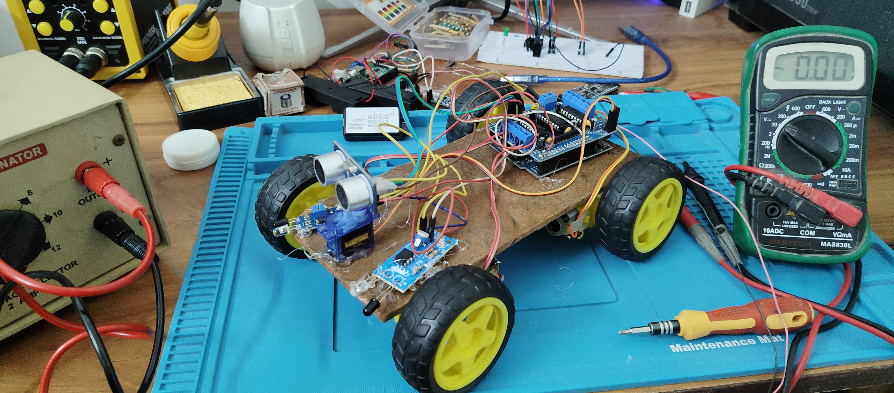

# Obstacle Avoidance Car using Arduino

 ## Project Images
  

This project demonstrates an obstacle avoidance car built with Arduino. The car uses an ultrasonic sensor to detect obstacles and infrared sensors to prevent falling off surfaces. The car is equipped with DC motors controlled by an L293D motor shield and can autonomously navigate around obstacles.

## Components Used
- **Arduino UNO**  
- **Ultrasonic Sensor (HC-SR04)**  
- **2 Infrared Sensors**  
- **L293D Motor Shield**  
- **DC Motors**  
- **9V Battery**  
- **Servo Motor**  
- **AFMotor Library**  
- **NewPing Library**  
- **Servo Library**  

## Libraries Required
Before uploading the code, you need to install the necessary libraries:
1. **AFMotor Library**  
   [Install Link](https://learn.adafruit.com/adafruit-motor-shield/library-install)
2. **NewPing Library**  
   [Install Link](https://github.com/livetronic/Arduino-NewPing)
3. **Servo Library**  
   [Install Link](https://github.com/arduino-libraries/Servo.git)

To install these libraries, go to **Sketch** > **Include Library** > **Add .ZIP File**, and select the downloaded ZIP files.

## Circuit Diagram
The circuit involves connecting the ultrasonic sensor, infrared sensors, DC motors, and servo motor to the Arduino board using the L293D motor shield for motor control.

## How it Works
- **Obstacle Detection:** The ultrasonic sensor measures the distance to nearby obstacles. If an obstacle is detected within 15 cm, the car will stop, move backward, and turn either left or right based on the clear path.
- **Edge Detection:** The infrared sensors help prevent the car from falling off the edge of a surface (e.g., a table).
- **Motor Control:** The DC motors are controlled through the L293D motor shield, and the car adjusts its direction based on the readings from the ultrasonic and infrared sensors.
